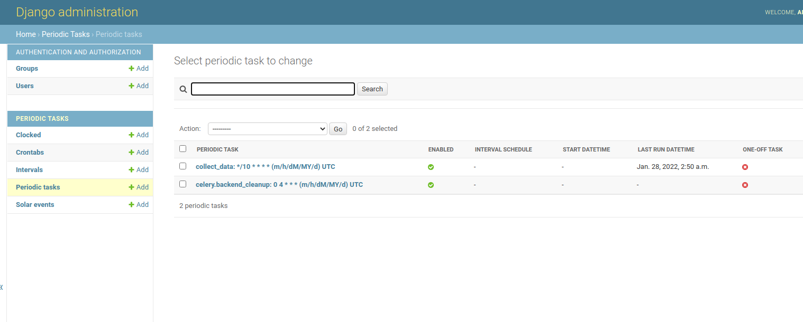

# News scraper Project

## Overview
This project is about collecting data from yahoo rss feeds.
It contains django web application (fetching data), postgresql(storing data), 
celery worker and beat (running and storing periodic jobs), gunicorn(wsgi server), 
and nginx(reverse proxy for gunicorn).

## Run project

### Configuration

In ```envs/variables.env``` there are all configurable variables. 
5 types of configurations are included in this file:
```
    Api config: Config based on api for collecting feeds. You can change dinamicly which symbols do you want to collect.
    Celery config: Do not change, except you dont want redis broker.
    Redis config: Do not change, except if you want to use redis outside of docker network.
    Admin config: Admin user is saved based on this config.
```

### Prebuild docker images
    * bergo1305/news-base:latest
This image is builded from ```docker/DockerFile.base``` and uploaded into docker hub.

To run whole project, execute
```
    docker-compose up -d
```

## Django API


1. http://localhost:8081/api/news?s=AAPL - endpoint for getting all data which have symbol AAPL. This symbol is required in query params.

2. http://localhost:8081/api/news?s=AAPL?page=1&limit=10 - endpoint for paginating through response data. Default page size is 10, and limit is 100. Starting page is 1.

3. http://localhost:8081/api/news?s=Test - symbol s in query params need to be included in env $SYMBOL_TYPES in order to worker collect data for that symbol(if exists).
This endpoint will be 400 status - BadRequest.


## Admin interface - scheduling tasks
When all services are up and running, period task('collect_data') is automatically scheduled. 
This task is scheduled every 10 minutes(default).

At http://localhost:8081/admin/django_celery_beat/periodictask/ as an admin, you can add, delete, scheduled any tasks. 
Interface should look like this:




For any question, or problems that you have regarding on this project contact: 
```
    matberin.spaha@hotmail.com
```
